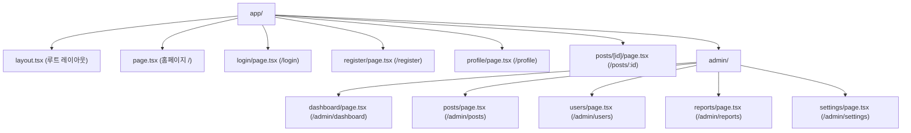

```mermaid
graph TD
    A["app/"] --> B["layout.tsx (루트 레이아웃)"]
    A --> C["page.tsx (홈페이지 /)"]
    A --> D["login/page.tsx (/login)"]
    A --> E["register/page.tsx (/register)"]
    A --> F["profile/page.tsx (/profile)"]
    A --> G["posts/[id]/page.tsx (/posts/:id)"]
    A --> H["admin/"]
    H --> I["dashboard/page.tsx (/admin/dashboard)"]
    H --> J["posts/page.tsx (/admin/posts)"]
    H --> K["users/page.tsx (/admin/users)"]
    H --> L["reports/page.tsx (/admin/reports)"]
    H --> M["settings/page.tsx (/admin/settings)"]
```